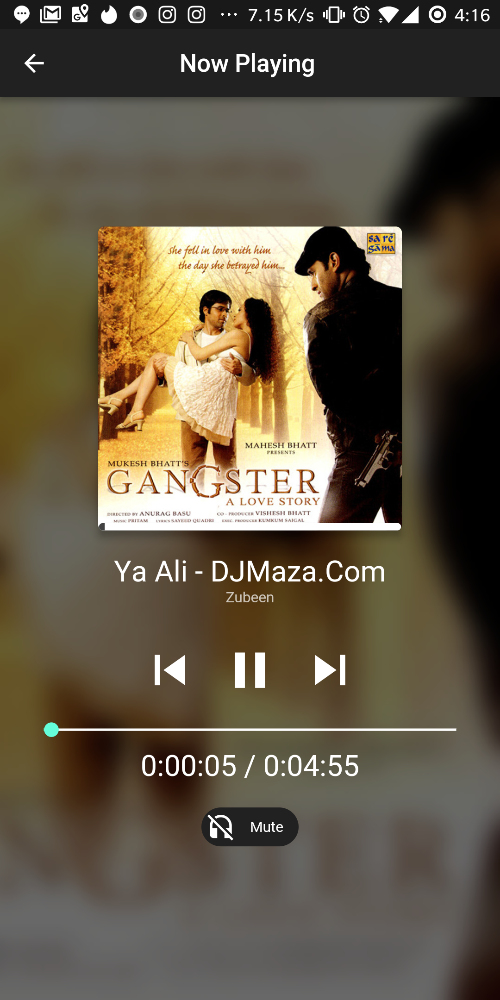

# Flutter Music Player

First Open Source Flutter based Beautiful Material Design Music Player(Online Radio will be added soon.)

# Demo App

[Play Store BETA](https://play.google.com/store/apps/details?id=com.mtechviral.fluttermusicplayer)

## Features

* [x] Android (iOS Coming Soon)

  * [x] Fetch local songs (Inbuilt Permission)
  * [x] Beautiful UI with multiple themes(Coming Soon)
  * [x] Animation
  * [x] Full Fledged Example
  * [x] play (local files)
  * [x] stop
  * [x] pause
  * [x] seek
  * [x] shuffle
  * [x] Album Art
  * [x] onComplete
  * [x] onDuration / onCurrentPosition

### Show some :heart: and star the repo to support the project

### Screenshots

    

* Note - This project also has a plugin to fetch songs and use audio player which can be used in any of your projects. Check the below link.

### Flute Music Player Plugin

[Plugin](https://github.com/iampawan/Flute-Music-Player)

